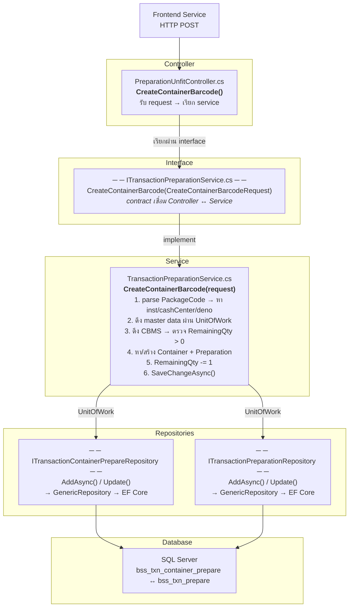
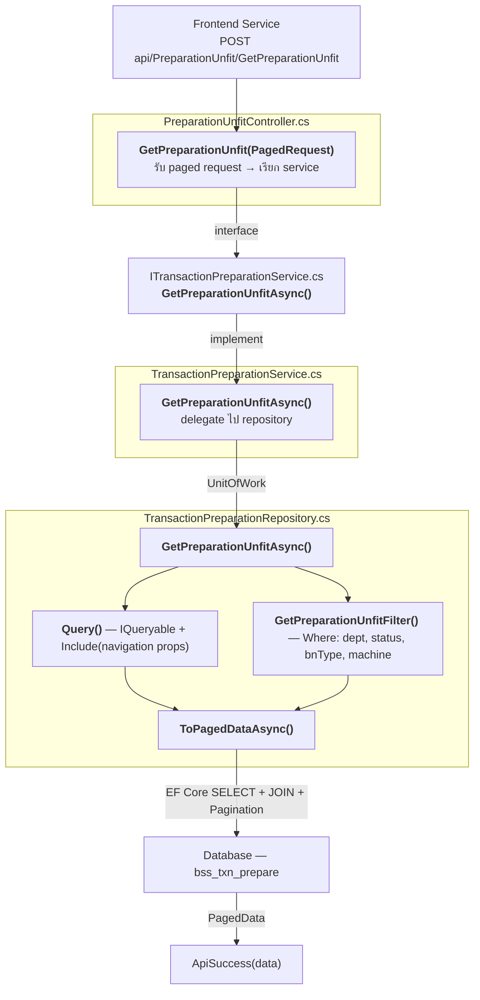
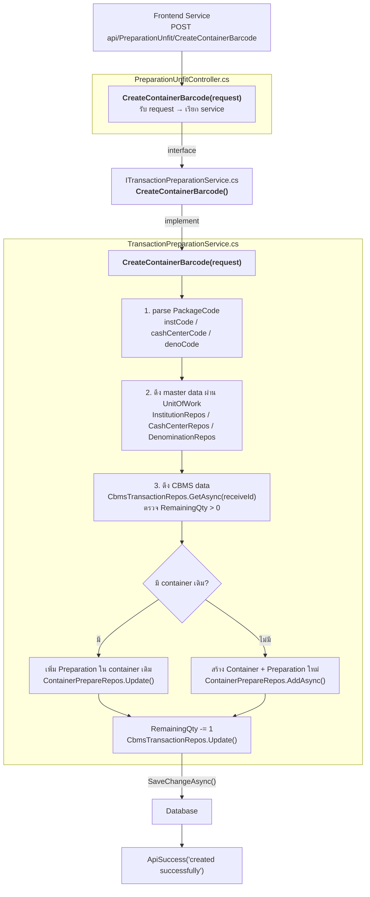
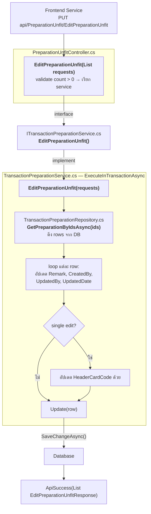
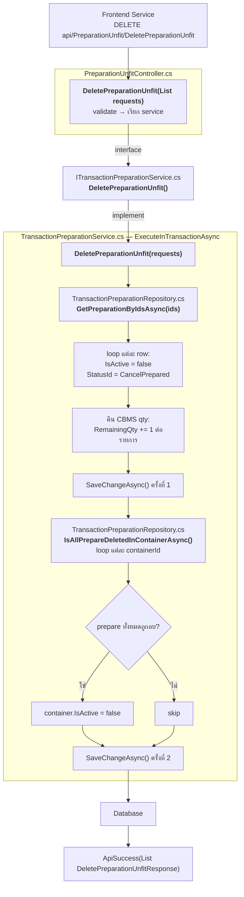

# Backend Flow — คู่มือสำหรับนักพัฒนา

ภาพรวมการทำงานฝั่ง Backend (ASP.NET Core Web API)
ใช้หน้า **Preparation Unfit** เป็นตัวอย่าง

---

## Full Flow — ข้อมูลเดินทางผ่านไฟล์ไหน function อะไร

ตัวอย่าง: Frontend เรียก `CreateContainerBarcode` (สแกน barcode ครบ 4 step)

```
                     ════════════════════
                      Frontend Service
                      HTTP POST → api/PreparationUnfit/CreateContainerBarcode
                     ════════════════════
                               │
                               ▼
┌─────────────────────────────────────────────────────────────────────┐
│  PreparationUnfitController.cs                                      │
│  [ApiController] [Route("api/[controller]")]                        │
│                                                                     │
│  CreateContainerBarcode(CreateContainerBarcodeRequest request)       │
│  [HttpPost("CreateContainerBarcode")]                               │
│    → รับ JSON body, deserialize เป็น CreateContainerBarcodeRequest  │
│    → เรียก service ผ่าน interface                                   │
│    → await _transactionPreparationService                           │
│            .CreateContainerBarcode(request)                         │
│    → return ApiSuccess("created successfully")                      │
└──────────────────────────────┬──────────────────────────────────────┘
                               │ เรียกผ่าน interface
                               ▼
┌ ─ ─ ─ ─ ─ ─ ─ ─ ─ ─ ─ ─ ─ ─ ─ ─ ─ ─ ─ ─ ─ ─ ─ ─ ─ ─ ─ ─ ─ ─ ┐
  ITransactionPreparationService.cs  (interface — เชื่อม Ctrl ↔ Svc)
│                                                                     │
  Task CreateContainerBarcode(CreateContainerBarcodeRequest request)
│   → สร้าง container + preparation จาก barcode ที่สแกน              │
└ ─ ─ ─ ─ ─ ─ ─ ─ ─ ─ ─ ─ ─ ─ ─ ─ ─ ─ ─ ─ ─ ─ ─ ─ ─ ─ ─ ─ ─ ─ ┘
                               │ implement
                               ▼
┌─────────────────────────────────────────────────────────────────────┐
│  TransactionPreparationService.cs                                   │
│                                                                     │
│  CreateContainerBarcode(request)                                    │
│    1. parse PackageCode:                                            │
│       instCode      = PackageCode[0..3]    → หาธนาคาร              │
│       cashCenterCode = PackageCode[3..6]   → หา cash center         │
│       denoCode      = PackageCode[7]       → หาราคาธนบัตร           │
│                                                                     │
│    2. ดึงข้อมูล master ผ่าน UnitOfWork:                             │
│       unitOfWork.InstitutionRepos.GetAsync(instCode)                │
│       unitOfWork.CashCenterRepos.GetAsync(cashCenterCode)           │
│       unitOfWork.DenominationRepos.GetAsync(denoCode)               │
│                                                                     │
│    3. ดึง CBMS data:                                                │
│       unitOfWork.CbmsTransactionRepos.GetAsync(receiveId)           │
│       → ตรวจว่า RemainingQty > 0                                   │
│                                                                     │
│    4. หา container เดิมหรือสร้างใหม่:                               │
│       ├→ มี container เดิม → เพิ่ม Preparation → Update             │
│       └→ ไม่มี → สร้าง Container + Preparation → AddAsync           │
│                                                                     │
│    5. receiveCbmsData.RemainingQty -= 1                              │
│    6. unitOfWork.SaveChangeAsync()                                  │
└──────────────────────┬──────────────────┬───────────────────────────┘
                       │                  │
          ผ่าน UnitOfWork               ผ่าน UnitOfWork
          (interface ภายใน)              (interface ภายใน)
                       ▼                  ▼
┌ ─ ─ ─ ─ ─ ─ ─ ─ ─ ─ ─ ─ ─ ┐  ┌ ─ ─ ─ ─ ─ ─ ─ ─ ─ ─ ─ ─ ─ ─ ┐
  ITransactionContainer-        ITransactionPreparation-
│ PrepareRepository             │ Repository                        │
  AddAsync() / Update()          AddAsync() / Update()
│ → table: bss_txn_            │ → table: bss_txn_prepare          │
│   container_prepare           │                                   │
└ ─ ─ ─ ─ ─ ┬─ ─ ─ ─ ─ ─ ─ ┘  └ ─ ─ ─ ─ ─ ─ ─ ┬─ ─ ─ ─ ─ ─ ─ ┘
             │ implement (GenericRepository)       │ implement
             ▼                                     ▼
┌─────────────────────────────────────────────────────────────────────┐
│  Database (SQL Server)                                              │
│                                                                     │
│  bss_txn_container_prepare     bss_txn_prepare                      │
│  ┌──────────────────────┐      ┌──────────────────────┐            │
│  │ container_prepare_id │←────→│ container_prepare_id │            │
│  │ container_code       │      │ prepare_id           │            │
│  │ department_id        │      │ header_card_code     │            │
│  │ receive_id           │      │ package_code         │            │
│  │ bntype_id            │      │ bundle_code          │            │
│  └──────────────────────┘      │ inst_id, deno_id     │            │
│                                └──────────────────────┘            │
└─────────────────────────────────────────────────────────────────────┘
```

> เส้นประ `─ ─ ─` = interface (contract), เส้นทึบ `─────` = ไฟล์จริง

### Mermaid Version



---

## ภาพรวม Flow

```
Frontend (HTTP Request)
  │
  ▼
Controller (.cs)         ← รับ request, validate, เรียก service
  │
  ▼
Service (.cs)            ← business logic ทั้งหมดอยู่ที่นี่
  │
  ▼
Repository (.cs)         ← query / insert / update / delete ฐานข้อมูล
  │
  ▼
Entity (.cs)             ← map กับ table ในฐานข้อมูล
  │
  ▼
Database (SQL Server)
```

---

## 1. Controller — จุดรับ request จาก frontend

| ไฟล์ | หน้าที่ |
|------|--------|
| `Controllers/PreparationUnfitController.cs` | รับ HTTP request จาก frontend, validate input, เรียก service |

**API Route:** `api/PreparationUnfit`

**สิ่งที่ต้องรู้:**
- แต่ละหน้ามี controller แยก (Unfit, CA Member, CA Non-Member, CC)
- Controller ไม่มี business logic — แค่ validate → เรียก service → คืน response
- ใช้ `[HttpGet]`, `[HttpPost]`, `[HttpPut]`, `[HttpDelete]` กำหนด HTTP method

**ตัวอย่าง action ที่คาดว่ามี:**
```
GET    api/PreparationUnfit          → ดึงรายการทั้งหมด
GET    api/PreparationUnfit/{id}     → ดึงรายการตาม id
POST   api/PreparationUnfit          → สร้างรายการใหม่
PUT    api/PreparationUnfit          → แก้ไขรายการ
DELETE api/PreparationUnfit          → ลบรายการ
```

---

## 2. Service — หัวใจของ business logic

| ไฟล์ | หน้าที่ |
|------|--------|
| `Services/TransactionPreparationService.cs` | **(shared)** business logic ของทั้ง 4 หน้า |
| `Services/Interface/ITransactionPreparationService.cs` | interface สำหรับ DI |

**สิ่งที่ต้องรู้:**
- **ทั้ง 4 หน้าใช้ service ตัวเดียวกัน** — แยก logic ด้วย parameter (เช่น type ของ preparation)
- ที่นี่คือที่ที่ business rule อยู่: validation ซับซ้อน, คำนวณ, เงื่อนไขต่างๆ
- Service เรียก Repository เพื่อคุยกับฐานข้อมูล
- ถ้าจะแก้ logic → เริ่มดูที่ service ก่อน

---

## 3. Repository — คุยกับฐานข้อมูล

| ไฟล์ | หน้าที่ |
|------|--------|
| `Repositories/TransactionPreparationRepository.cs` | **(shared)** query / insert / update / delete |
| `Repositories/Interface/ITransactionPreparationRepository.cs` | interface สำหรับ DI |

**สิ่งที่ต้องรู้:**
- Repository ไม่มี business logic — แค่ CRUD กับฐานข้อมูล
- ใช้ Entity Framework Core (หรือ Dapper) ในการ query
- ทั้ง 4 หน้าใช้ repository ตัวเดียวกัน (เพราะใช้ table เดียวกัน)

---

## 4. Entity — แผนที่ของ table ในฐานข้อมูล

| ไฟล์ | หน้าที่ |
|------|--------|
| `Models/Entities/TransactionPreparation.cs` | **(shared)** map กับ table `TransactionPreparation` |

**สิ่งที่ต้องรู้:**
- 1 Entity = 1 Table (หรือ view)
- property ใน entity = column ใน table
- ทั้ง 4 ประเภท preparation อยู่ใน table เดียวกัน แยกด้วย column ประเภท

---

## 5. Models — โครงสร้างข้อมูล request / response

```
Frontend → RequestModel → Controller → Service → Repository → Entity → DB
DB → Entity → Repository → Service → Controller → ResponseModel → Frontend
```

| ประเภท | ตัวอย่าง | ใช้ตรงไหน |
|--------|---------|----------|
| **RequestModel** | `PreparationUnfitRequest.cs`, `EditPreparationUnfitRequest.cs` | Frontend → Controller (JSON body ที่รับเข้ามา) |
| **ResponseModel** | `PreparationUnfitResponse.cs`, `DeletePreparationUnfitResponse.cs` | Controller → Frontend (JSON body ที่ส่งกลับ) |
| **Shared Request** | `CreatePreparationRequest.cs`, `UpdatePreparationRequest.cs` | ใช้ร่วมกันทั้ง 4 หน้า |
| **Shared Response** | `PreparationAllTypeResponse.cs` | response รวมทุกประเภท |
| **ReportModel** | `PreparationUnfitReportModel.cs` | สร้าง Excel report |

**สิ่งที่ต้องรู้:**
- RequestModel = ข้อมูลขาเข้า (frontend ส่งมา)
- ResponseModel = ข้อมูลขาออก (backend ส่งกลับ)
- แต่ละหน้ามี request/response model เฉพาะตัว + model ที่ใช้ร่วม (shared)

---

## สรุป Flow เต็ม (ตัวอย่าง: สร้างรายการ Unfit ใหม่)

```
1. Frontend ส่ง POST api/PreparationUnfit พร้อม JSON body
              │
2. Controller (PreparationUnfitController.cs)
   - deserialize JSON → PreparationUnfitRequest
   - validate input
   - เรียก service
              │
3. Service (TransactionPreparationService.cs)
   - ตรวจ business rule (เช่น ซ้ำไหม, ข้อมูลครบไหม)
   - แปลง request → entity
   - เรียก repository
              │
4. Repository (TransactionPreparationRepository.cs)
   - INSERT entity ลงฐานข้อมูล
   - คืน entity ที่บันทึกแล้ว (มี ID)
              │
5. Service แปลง entity → response
              │
6. Controller คืน PreparationUnfitResponse เป็น JSON
              │
7. Frontend ได้รับ response → แสดงผล
```

---

## Shared vs Page-Specific

| ชั้น | Shared (ทั้ง 4 หน้า) | Page-Specific (เฉพาะ Unfit) |
|------|----------------------|----------------------------|
| Controller | — | `PreparationUnfitController.cs` |
| Service | `TransactionPreparationService.cs` | — |
| Repository | `TransactionPreparationRepository.cs` | — |
| Entity | `TransactionPreparation.cs` | — |
| Request | `CreatePreparationRequest.cs` | `PreparationUnfitRequest.cs` |
| Response | `PreparationAllTypeResponse.cs` | `PreparationUnfitResponse.cs` |

**หลักคิด:** Service, Repository, Entity ใช้ร่วม เพราะทั้ง 4 ประเภทเป็น "Preparation" เหมือนกัน แค่ต่าง type — ส่วน Controller และ Request/Response model แยกตามหน้าเพื่อให้ API ชัดเจน

---

## ไฟล์ Shared ทั้งหมด

ดูรายการเต็มที่ [`src/domain/preparation/index.md`](../../domain/preparation/index.md) ส่วน "Shared Backend Files"

---
---

# Deep Dive — เส้นทางโค้ดจริง (Preparation Unfit)

ด้านล่างคือเส้นทางการทำงานจริงจาก source code
แสดงว่า request เข้ามาผ่านไฟล์ไหน → function อะไร → ลงไปถึง DB อย่างไร

---

## DI & Interface — หลักการที่ต้องรู้ก่อน

Backend ใช้ **Unit of Work + Repository pattern** ผ่าน DI:

```csharp
// PreparationUnfitController.cs — inject service ผ่าน interface
public class PreparationUnfitController : BaseController
{
    private readonly ITransactionPreparationService _transactionPreparationService;
    private readonly ITransactionContainerPrepareService _transactionContainerPrepareService;
    private readonly ICbmsTransactionService _cbmsTransactionService;
    // ... constructor inject
}

// TransactionPreparationService.cs — inject UnitOfWork
public class TransactionPreparationService(IUnitOfWork unitOfWork)
    : ITransactionPreparationService
{
    // ใช้ unitOfWork.TransactionPreparationRepos.xxx()
    // ใช้ unitOfWork.TransactionContainerPrepareRepos.xxx()
    // ใช้ unitOfWork.CbmsTransactionRepos.xxx()
}

// TransactionPreparationRepository.cs — สืบทอด GenericRepository
public class TransactionPreparationRepository(ApplicationDbContext db)
    : GenericRepository<TransactionPreparation>(db),
      ITransactionPreparationRepository
{
    // GenericRepository ให้ GetAsync, GetAllAsync, AddAsync, Update, Delete
    // + custom query methods
}
```

**เวลาสร้าง function ใหม่:**
1. เพิ่มใน `ITransactionPreparationRepository.cs` (ถ้าต้อง query ใหม่)
2. implement ใน `TransactionPreparationRepository.cs`
3. เพิ่มใน `ITransactionPreparationService.cs`
4. implement ใน `TransactionPreparationService.cs`
5. เรียกใน `PreparationUnfitController.cs`

---

## Flow 1: ดึงรายการ (GetPreparationUnfit) — Paged List



| # | ไฟล์ | Function | ทำอะไร |
|---|------|----------|--------|
| 1 | `PreparationUnfitController.cs` | `GetPreparationUnfit(PagedRequest<PreparationUnfitRequest>, CancellationToken)` [HttpPost] | รับ paged request → เรียก service → คืน `ApiSuccess(data)` หรือ `ApiDataNotFound` |
| 2 | `ITransactionPreparationService.cs` | `GetPreparationUnfitAsync(PagedRequest<PreparationUnfitRequest>, CancellationToken)` | **interface** — return `PagedData<PreparationUnfitResponse>` |
| 3 | `TransactionPreparationService.cs` | `GetPreparationUnfitAsync(...)` | delegate ตรงไป repository — ไม่มี logic เพิ่ม |
| 4 | `ITransactionPreparationRepository.cs` | `GetPreparationUnfitAsync(PagedRequest<PreparationUnfitRequest>, CancellationToken)` | **interface** |
| 5 | `TransactionPreparationRepository.cs` | `GetPreparationUnfitAsync(...)` | เรียก `Query()` + `GetPreparationUnfitFilter()` + `.ToPagedDataAsync()` |
| 5a | `TransactionPreparationRepository.cs` | `Query()` (private) | สร้าง `IQueryable` พร้อม `.Include()` ทุก navigation property |
| 5b | `TransactionPreparationRepository.cs` | `GetPreparationUnfitFilter()` (private) | สร้าง filter: `DepartmentId`, `IsReconcile`, `IsActive`, `StatusId`, `BnTypeId`, `MachineId?` |

---

## Flow 2: สร้าง Container Barcode (core flow ตอนสแกนครบ 4 step)

นี่คือ flow ที่ซับซ้อนที่สุด — เกิดตอน user สแกน header card (step 4)



| # | ไฟล์ | Function | ทำอะไร |
|---|------|----------|--------|
| 1 | `PreparationUnfitController.cs` | `CreateContainerBarcode(CreateContainerBarcodeRequest)` [HttpPost] | รับ request → เรียก service → คืน success |
| 2 | `ITransactionPreparationService.cs` | `CreateContainerBarcode(CreateContainerBarcodeRequest)` | **interface** |
| 3 | `TransactionPreparationService.cs` | `CreateContainerBarcode(request)` | **logic หลัก:** |
| | | | — parse `PackageCode` → หา institution (3 ตัวแรก), cashCenter (ตัวที่ 4-6), deno (ตัวที่ 8) |
| | | | — ดึง `ReceiveCbmsData` ตรวจว่า `RemainingQty > 0` |
| | | | — หา container เดิม หรือสร้างใหม่ |
| | | | — สร้าง `TransactionPreparation` entity ใส่ใน container |
| | | | — ลด `RemainingQty -= 1` |
| | | | — `SaveChangeAsync()` |

---

## Flow 3: แก้ไข (EditPreparationUnfit) — Batch Edit + Transaction



| # | ไฟล์ | Function | ทำอะไร |
|---|------|----------|--------|
| 1 | `PreparationUnfitController.cs` | `EditPreparationUnfit(List<EditPreparationUnfitRequest>)` [HttpPut] | validate count > 0 → เรียก service → try/catch log error |
| 2 | `ITransactionPreparationService.cs` | `EditPreparationUnfit(List<EditPreparationUnfitRequest>)` | **interface** — return `List<EditPreparationUnfitResponse>` |
| 3 | `TransactionPreparationService.cs` | `EditPreparationUnfit(requests)` | **logic:** ใช้ `ExecuteInTransactionAsync` ครอบ |
| | | | — `GetPreparationByIdsAsync(ids)` ดึง rows |
| | | | — loop อัปเดต: `Remark`, `CreatedBy`, `UpdatedBy`, `UpdatedDate` |
| | | | — single edit: อัปเดต `HeaderCardCode` ด้วย |
| | | | — `SaveChangeAsync()` |
| 4 | `ITransactionPreparationRepository.cs` | `GetPreparationByIdsAsync(List<long>)` | **interface** |
| 5 | `TransactionPreparationRepository.cs` | `GetPreparationByIdsAsync(ids)` | EF Core query `.Where(x => ids.Contains(x.PrepareId))` |

---

## Flow 4: ลบ (DeletePreparationUnfit) — Soft Delete + Restore CBMS Qty



| # | ไฟล์ | Function | ทำอะไร |
|---|------|----------|--------|
| 1 | `PreparationUnfitController.cs` | `DeletePreparationUnfit(List<DeletePreparationUnfitRequest>)` [HttpDelete] | validate → เรียก service → try/catch |
| 2 | `ITransactionPreparationService.cs` | `DeletePreparationUnfit(List<DeletePreparationUnfitRequest>)` | **interface** — return `List<DeletePreparationUnfitResponse>` |
| 3 | `TransactionPreparationService.cs` | `DeletePreparationUnfit(requests)` | **logic หลัก:** |
| | | | — soft delete: `IsActive = false`, `StatusId = CancelPrepared` |
| | | | — **คืน CBMS qty:** `RemainingQty += 1` ต่อรายการ |
| | | | — **ลบ container:** ถ้า prepare ทั้งหมดในภาชนะถูกลบ → container.IsActive = false |
| 4 | `ITransactionPreparationRepository.cs` | `IsAllPrepareDeletedInContainerAsync(long containerId)` | **interface** — ตรวจว่า prepare ทุกตัวใน container ถูกลบหมดหรือยัง |
| 5 | `TransactionPreparationRepository.cs` | `IsAllPrepareDeletedInContainerAsync(...)` | EF Core: `.Where(containerId).All(x => x.IsActive == false)` |

---

## Flow 5: Generate Dummy Barcode

| # | ไฟล์ | Function | ทำอะไร |
|---|------|----------|--------|
| 1 | `PreparationUnfitController.cs` | `GenerateDummyBarCode(CreateDummyBarcode)` [HttpPost] | รับ request → เรียก service |
| 2 | `ITransactionPreparationService.cs` | `GenerateDummyBarcodeAsync(CreateDummyBarcode)` | **interface** |
| 3 | `TransactionPreparationService.cs` | `GenerateDummyBarcodeAsync(request)` | ดึง `ReceiveCbmsData` → คำนวณ `preparatedCount` = `UnfitQty - RemainingQty` → ใช้ `BarcodeService` สร้าง dummy barcode |

---

## Entity — Table Map (bss_txn_prepare)

```csharp
// TransactionPreparation.cs → table "bss_txn_prepare"
[Table("bss_txn_prepare")]
public class TransactionPreparation
{
    [Key]   long PrepareId              // PK
            long ContainerPrepareId     // FK → TransactionContainerPrepare
            string HeaderCardCode       // barcode header card
            string PackageCode          // barcode ห่อ (wrap)
            string BundleCode           // barcode มัด
            long? TransactionUnsortCCId // FK → TransactionUnsortCC (nullable)
            int InstId                  // FK → MasterInstitution (ธนาคาร)
            int? CashcenterId           // FK → MasterCashCenter
            int? ZoneId                 // FK → MasterZone
            int? CashpointId            // FK → MasterCashPoint
            int DenoId                  // FK → MasterDenomination (ราคาธนบัตร)
            int Qty                     // จำนวน
            string? Remark
            int StatusId                // FK → MasterStatus
            DateTime PrepareDate
            bool? IsReconcile
            bool? IsActive              // soft delete flag
            int? CreatedBy              // FK → MasterUser
            DateTime CreatedDate
            int? UpdatedBy              // FK → MasterUser
            DateTime? UpdatedDate
            bool? IsMatchMachine
}
```

---

## สรุป: API Endpoints ทั้งหมดของ PreparationUnfitController

| HTTP | Route | Controller Function | Service Function | ทำอะไร |
|------|-------|-------------------|-----------------|--------|
| GET | `GetUnfit?departmentId=` | `GetUnFit()` | `GetPreparationByDepartment()` | ดึงรายการตาม department |
| GET | `GetAllPreparation` | `GetAllPreparationAsync()` | `GetAllPreparationAsync()` | ดึงรายการทั้งหมด |
| GET | `GetPreparationById?prepareId=` | `GetPreparationByIdAsync()` | `GetPreparationByIdAsync()` | ดึงรายการตาม ID |
| POST | `CreatePreparation` | `Create()` | `CreatePreparation()` | สร้างรายการ |
| PUT | `UpdatePreparation` | `Update()` | `UpdatePreparation()` | แก้ไขรายการ |
| DELETE | `RemovePreparation?prepareId=` | `RemovePreparation()` | `DeletePreparation()` | ลบรายการ |
| POST | `CreateContainerBarcode` | `CreateContainerBarcode()` | `CreateContainerBarcode()` | **สร้าง container + prepare (scan flow)** |
| POST | `GetPreparationUnfit` | `GetPreparationUnfit()` | `GetPreparationUnfitAsync()` | **ดึงรายการ paged + filter** |
| PUT | `EditPreparationUnfit` | `EditPreparationUnfit()` | `EditPreparationUnfit()` | **แก้ไข batch + OTP** |
| DELETE | `DeletePreparationUnfit` | `DeletePreparationUnfit()` | `DeletePreparationUnfit()` | **ลบ batch + คืน CBMS qty** |
| POST | `GenerateDummyBarCode` | `GenerateDummyBarCode()` | `GenerateDummyBarcodeAsync()` | สร้าง dummy barcode |
| POST | `GetCountPrepareByContainer` | `GetCountPrepareByContainer()` | `GetCountPrepareByContainerAsync()` | นับ prepare ต่อ container |
| POST | `GetCountReconcile` | `GetCountReconcile()` | `GetCountReconcileAsync()` | นับจำนวน reconcile |
| GET | `GetAllContainerPrepare?dept=` | `GetAllContainerPrepareAsync()` | (ContainerPrepareService) | ดึง container ทั้งหมด |
| GET | `GetContainerPrepareById?id=` | `GetContainerPrepareById()` | (ContainerPrepareService) | ดึง container ตาม ID |
| POST | `CreateContainerPrepare` | `Create()` | (ContainerPrepareService) | สร้าง container |
| PUT | `UpdateContainerPrepare` | `Update()` | (ContainerPrepareService) | แก้ไข container |
| DELETE | `RemoveContainerPrepare?Id=` | `Remove()` | (ContainerPrepareService) | ลบ container |

---

## สรุป: เวลาจะสร้าง feature ใหม่ ต้องแก้/สร้างไฟล์อะไรบ้าง

```
1. (ถ้าต้อง query ใหม่)
   ITransactionPreparationRepository.cs  → เพิ่ม method ใน interface
   TransactionPreparationRepository.cs   → implement query (EF Core)

2. ITransactionPreparationService.cs     → เพิ่ม method ใน interface
   TransactionPreparationService.cs      → implement logic (เรียก repository)

3. PreparationUnfitController.cs         → สร้าง action [HttpPost/Put/Delete]

4. (ถ้ามี model ใหม่)
   Models/RequestModels/xxx.cs           → request DTO
   Models/ResponseModels/xxx.cs          → response DTO
```
