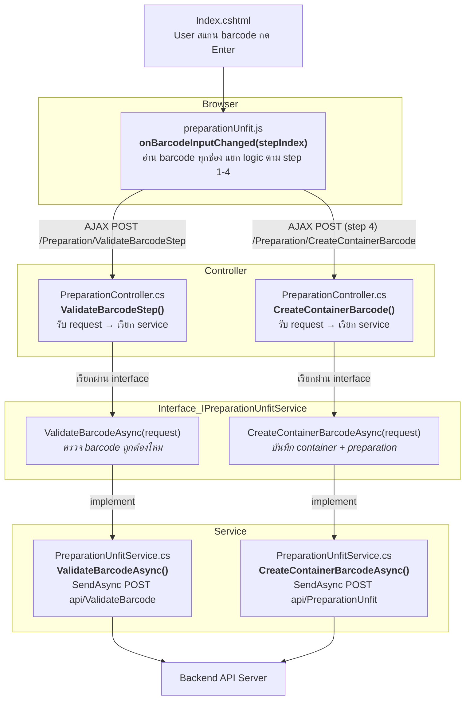
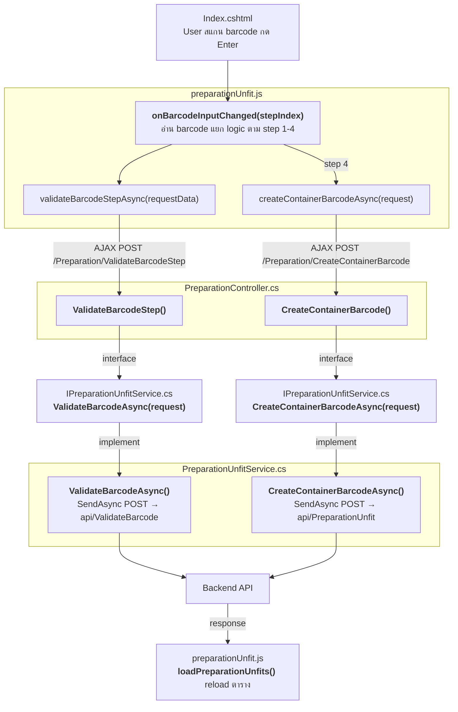
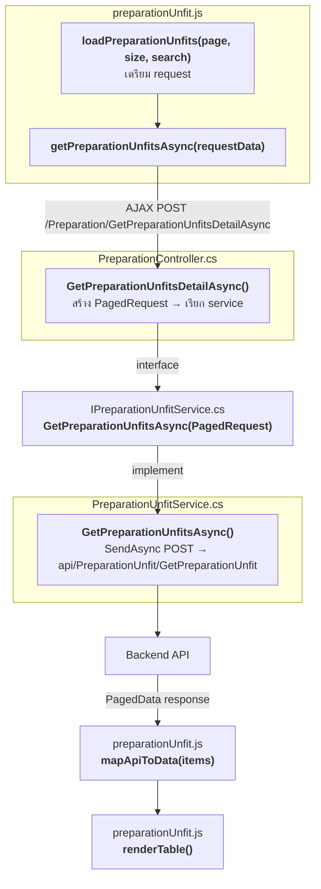
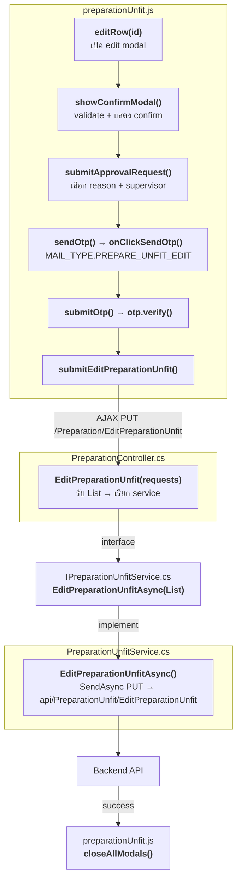

# Frontend Flow — คู่มือสำหรับนักพัฒนา

ภาพรวมการทำงานฝั่ง Frontend (ASP.NET Core MVC)
ใช้หน้า **Preparation Unfit** เป็นตัวอย่าง

---

## Full Flow — ข้อมูลเดินทางผ่านไฟล์ไหน function อะไร

ตัวอย่าง: User สแกน barcode ครบ 4 step → บันทึกรายการ

```
┌─────────────────────────────────────────────────────────────────────┐
│  Index.cshtml                                                       │
│  User สแกน barcode ที่ช่อง input → กด Enter/Tab                     │
└──────────────────────────────┬──────────────────────────────────────┘
                               │
                               ▼
┌─────────────────────────────────────────────────────────────────────┐
│  preparationUnfit.js                                                │
│                                                                     │
│  onBarcodeInputChanged(stepIndex)                                   │
│    ฟังก์ชันหลัก — อ่าน barcode ทุกช่อง แยก logic ตาม step 1-4      │
│    │                                                                │
│    ├→ validateBarcodeStepAsync(requestData)                         │
│    │    AJAX POST → /Preparation/ValidateBarcodeStep                │
│    │                                                                │
│    └→ (step 4) createContainerBarcodeAsync(request)                 │
│         AJAX POST → /Preparation/CreateContainerBarcode             │
└──────────────────────────────┬──────────────────────────────────────┘
                               │ AJAX POST
                               ▼
┌─────────────────────────────────────────────────────────────────────┐
│  PreparationController.cs                                           │
│                                                                     │
│  ValidateBarcodeStep() [HttpPost]                                   │
│    รับ request จาก JS → เรียก service ผ่าน interface                │
│    return Json(_preparationUnfitService.ValidateBarcodeAsync(...))  │
│                                                                     │
│  CreateContainerBarcode() [HttpPost]                                │
│    รับ SaveContainerPrepare request                                 │
│    return Json(_preparationUnfitService                             │
│                  .CreateContainerBarcodeAsync(...))                  │
└──────────────────────────────┬──────────────────────────────────────┘
                               │ เรียกผ่าน interface
                               ▼
┌ ─ ─ ─ ─ ─ ─ ─ ─ ─ ─ ─ ─ ─ ─ ─ ─ ─ ─ ─ ─ ─ ─ ─ ─ ─ ─ ─ ─ ─ ─ ┐
  IPreparationUnfitService.cs  (interface — เชื่อม Controller ↔ Service)
│                                                                     │
  Task<ValidateBarcodeResponse>
│   ValidateBarcodeAsync(ValidateBarcodeRequest request)              │
    → ตรวจ barcode ถูกต้องไหม ตาม step
│                                                                     │
  Task<BaseServiceResult>
│   CreateContainerBarcodeAsync(SaveContainerPrepare request)         │
    → บันทึก container + preparation ลง backend
└ ─ ─ ─ ─ ─ ─ ─ ─ ─ ─ ─ ─ ─ ─ ─ ─ ─ ─ ─ ─ ─ ─ ─ ─ ─ ─ ─ ─ ─ ─ ┘
                               │ implement
                               ▼
┌─────────────────────────────────────────────────────────────────────┐
│  PreparationUnfitService.cs  (extends BaseApiClient)                │
│                                                                     │
│  ValidateBarcodeAsync(request)                                      │
│    → SendAsync<ValidateBarcodeResponse>(                            │
│        HttpMethod.Post,                                             │
│        "api/ValidateBarcode/ValidateBarcode",                       │
│        request)                                                     │
│                                                                     │
│  CreateContainerBarcodeAsync(request)                               │
│    → SendAsync<BaseServiceResult>(                                  │
│        HttpMethod.Post,                                             │
│        "api/PreparationUnfit/CreateContainerBarcode",               │
│        request)                                                     │
└──────────────────────────────┬──────────────────────────────────────┘
                               │ HTTP POST (JSON)
                               ▼
                     ════════════════════
                      Backend API Server
                     ════════════════════
```

> เส้นประ `─ ─ ─` = interface (contract), เส้นทึบ `─────` = ไฟล์จริง

### Mermaid Version



---

## ภาพรวม Flow

```
Browser
  │
  ▼
View (.cshtml)              ← HTML + Razor syntax ที่ user เห็น
  │
  ▼
Code-Behind (.cshtml.cs)    ← Page model / view data binding
  │
  ▼
Controller (.cs)            ← รับ request, เรียก service, คืน view/json
  │
  ▼
Frontend Service (.cs)      ← เรียก Backend API ผ่าน HTTP
  │
  ▼
Backend API                 ← ออกจาก frontend ไปฝั่ง backend แล้ว
```

---

## 1. View — จุดเริ่มต้นที่ user เห็น

User เปิด browser เข้า route `/Preparation/PreparationUnfit`

| ไฟล์ | หน้าที่ |
|------|--------|
| `Views/Preparation/PreparationUnfit/Index.cshtml` | หน้าหลัก — แสดงรายการ, ฟอร์ม CRUD |
| `Views/Preparation/PreparationUnfit/Index.cshtml.cs` | Code-behind — bind ข้อมูลให้ view |
| `Views/Preparation/PreparationUnfit/PreparationUnfitPrint.cshtml` | หน้าพิมพ์ (layout ต่างจากหน้าหลัก) |
| `Views/Preparation/SecondScreenPreparationUnfit/Index.cshtml` | จอที่ 2 (dual-monitor) |

**สิ่งที่ต้องรู้:**
- `.cshtml` = HTML + Razor syntax (`@Model.xxx`, `@foreach`, etc.)
- `.cshtml.cs` = ผูก data ให้ view ใช้ (`public List<...> Items { get; set; }`)
- View ไม่มี business logic — แค่แสดงผล

---

## 2. Static Assets — CSS / JS ที่ทำงานบน browser

| ประเภท | ไฟล์ตัวอย่าง | หน้าที่ |
|--------|-------------|--------|
| CSS | `wwwroot/css/preparation/preparationUnfit.css` | จัด layout / style หน้าหลัก |
| CSS (พิมพ์) | `wwwroot/css/preparation/preparationUnfitPrint.css` | style เฉพาะหน้าพิมพ์ |
| JS | `wwwroot/js/preparation/preparationUnfit.js` | client-side logic (validate form, fetch data, UI interaction) |
| JS (พิมพ์) | `wwwroot/js/preparation/preparationUnfitPrint.js` | logic หน้าพิมพ์ |
| JS (จอที่ 2) | `wwwroot/js/preparation/secondScreenPreparationUnfit.js` | logic จอที่ 2 |

**สิ่งที่ต้องรู้:**
- JS เป็นตัวเรียก API ผ่าน `fetch()` / `$.ajax()` ไปที่ Controller
- CSS แยกไฟล์ตามหน้า — ไม่ปนกัน

---

## 3. Controller — ตัวกลางระหว่าง View กับ Service

| ไฟล์ | หน้าที่ |
|------|--------|
| `Controllers/PreparationController.cs` | **(shared)** รับ request จากทุกหน้า Preparation แล้วส่งต่อให้ service ที่ถูกตัว |

**สิ่งที่ต้องรู้:**
- Controller ไม่มี business logic — แค่รับ request → เรียก service → คืน response
- หน้า Preparation ทั้ง 4 (Unfit, CA Member, CA Non-Member, CC) ใช้ controller ตัวเดียวกัน
- แต่ละ action method จะเรียก service คนละตัวตามประเภทหน้า

---

## 4. Frontend Service — เรียก Backend API

| ไฟล์ | หน้าที่ |
|------|--------|
| `Services/PreparationUnfitService.cs` | เรียก Backend API (`api/PreparationUnfit`) ผ่าน HttpClient |
| `Interfaces/IPreparationUnfitService.cs` | interface สำหรับ DI |

**สิ่งที่ต้องรู้:**
- Service แต่ละหน้ามีตัวเอง (Unfit ใช้ `PreparationUnfitService`, CA Member ใช้ `PreparationUnsortCaMemberService`, ...)
- ภายในจะ serialize request เป็น JSON → POST/GET/PUT/DELETE ไป backend
- response กลับมาเป็น JSON → deserialize เป็น model

---

## 5. Models — โครงสร้างข้อมูลที่ใช้ส่งไปมา

```
View ←→ DisplayModel ←→ Controller ←→ ObjectModel ←→ Service ←→ ServiceModel ←→ Backend API
```

| ประเภท | ตัวอย่าง | ใช้ตรงไหน |
|--------|---------|----------|
| **ObjectModel** | `PreparationUnfitRequest.cs`, `EditPreparationUnfitRequest.cs` | Controller ↔ Service (request/response ภายใน frontend) |
| **ServiceModel** | `PreparationUnfitModel.cs`, `PreparationUnfitResult.cs` | Service ↔ Backend API (JSON body) |
| **DisplayModel** | `TransactionPreparationDisplay.cs` *(shared)* | Controller ↔ View (ข้อมูลที่ view แสดง) |
| **ReportModel** | `PreparationUnfitReportModel.cs` | สร้าง Excel report |

**สิ่งที่ต้องรู้:**
- ObjectModel = ข้อมูลไหลภายใน frontend
- ServiceModel = ข้อมูลที่คุยกับ backend API
- DisplayModel = ข้อมูลที่ view ต้องการ (อาจรวมหลาย source)

---

## สรุป Flow เต็ม (ตัวอย่าง: สร้างรายการ Unfit ใหม่)

```
1. User กรอกฟอร์มบน browser
           │
2. JS (preparationUnfit.js) validate + ส่ง fetch/ajax
           │
3. Controller (PreparationController.cs) รับ request
           │
4. Controller แปลงเป็น ObjectModel → เรียก Service
           │
5. Service (PreparationUnfitService.cs) แปลงเป็น ServiceModel
           │
6. Service ส่ง HTTP POST ไป Backend API (api/PreparationUnfit)
           │
7. Backend ตอบ JSON กลับมา
           │
8. Service แปลง JSON → ObjectModel → คืนให้ Controller
           │
9. Controller คืน response → JS อัปเดตหน้า
```

---

## ไฟล์ Shared ที่ทุกหน้า Preparation ใช้ร่วม

ดูรายการเต็มที่ [`src/domain/preparation/index.md`](../../domain/preparation/index.md) ส่วน "Shared Frontend Files"

---
---

# Deep Dive — เส้นทางโค้ดจริง (Preparation Unfit)

ด้านล่างคือเส้นทางการทำงานจริงจาก source code
แสดงว่าข้อมูลเดินทางผ่านไฟล์ไหน → function อะไร → เรียกอะไรต่อ

---

## DI & Interface — หลักการที่ต้องรู้ก่อน

ทุก Service ต้อง**มี interface คู่กัน** เพราะ Controller รับ service ผ่าน constructor injection:

```csharp
// PreparationController.cs — inject ผ่าน interface
public class PreparationController : BaseController
{
    private readonly IPreparationUnfitService _preparationUnfitService;
    // ... constructor รับ IPreparationUnfitService
}
```

```csharp
// IPreparationUnfitService.cs — interface กำหนด contract
public interface IPreparationUnfitService { ... }

// PreparationUnfitService.cs — implement interface + สืบทอด BaseApiClient
public class PreparationUnfitService : BaseApiClient, IPreparationUnfitService { ... }
```

**เวลาสร้าง function ใหม่:** เพิ่มใน interface ก่อน → implement ใน service → เรียกใน controller

---

## Flow 1: สแกน Barcode (core flow ของหน้า)

หน้า Unfit มี 4 step: Container → Wrap → Bundle → Header Card



### รายละเอียดแต่ละ function:

| # | ไฟล์ | Function | ทำอะไร |
|---|------|----------|--------|
| 1 | `preparationUnfit.js` | `onBarcodeInputChanged(stepIndex)` | ฟังก์ชันหลัก — อ่านค่า barcode ทุกช่อง, เรียก validate, แยก logic ตาม step 1-4 |
| 2 | `preparationUnfit.js` | `validateBarcodeStepAsync(requestData)` | AJAX POST → `/Preparation/ValidateBarcodeStep` |
| 3 | `PreparationController.cs` | `ValidateBarcodeStep()` [POST] | รับ request → เรียก service → คืน JSON |
| 4 | `IPreparationUnfitService.cs` | `ValidateBarcodeAsync(ValidateBarcodeRequest)` | **interface** — contract |
| 5 | `PreparationUnfitService.cs` | `ValidateBarcodeAsync(...)` | **implement** — `SendAsync` POST ไป `api/ValidateBarcode/ValidateBarcode` |
| 6 | `preparationUnfit.js` | `createContainerBarcodeAsync(request)` | AJAX POST → `/Preparation/CreateContainerBarcode` (เรียกที่ step 4) |
| 7 | `PreparationController.cs` | `CreateContainerBarcode()` [POST] | รับ request → เรียก service → คืน JSON |
| 8 | `IPreparationUnfitService.cs` | `CreateContainerBarcodeAsync(SaveContainerPrepare)` | **interface** |
| 9 | `PreparationUnfitService.cs` | `CreateContainerBarcodeAsync(...)` | **implement** — POST ไป `api/PreparationUnfit/CreateContainerBarcode` |

---

## Flow 2: โหลดตาราง



| # | ไฟล์ | Function | ทำอะไร |
|---|------|----------|--------|
| 1 | `preparationUnfit.js` | `loadPreparationUnfits(pageNumber, pageSize, search)` | เตรียม request → เรียก `getPreparationUnfitsAsync` |
| 2 | `preparationUnfit.js` | `getPreparationUnfitsAsync(requestData)` | AJAX POST → `/Preparation/GetPreparationUnfitsDetailAsync` |
| 3 | `PreparationController.cs` | `GetPreparationUnfitsDetailAsync()` [POST] | สร้าง `PagedRequest<PreparationUnfitRequest>` → เรียก service |
| 4 | `IPreparationUnfitService.cs` | `GetPreparationUnfitsAsync(PagedRequest<PreparationUnfitRequest>)` | **interface** |
| 5 | `PreparationUnfitService.cs` | `GetPreparationUnfitsAsync(...)` | **implement** — POST ไป `api/PreparationUnfit/GetPreparationUnfit` |
| 6 | `preparationUnfit.js` | `mapApiToData(items)` | แปลง API response → format ที่ตารางใช้ |
| 7 | `preparationUnfit.js` | `renderTable()` | สร้าง HTML table rows จากข้อมูล |

---

## Flow 3: แก้ไข (Edit) — มี OTP



| # | ไฟล์ | Function | ทำอะไร |
|---|------|----------|--------|
| 1 | `preparationUnfit.js` | `editRow(id)` / `editMultipleRows()` | เปิด edit modal, โหลดข้อมูลเดิม |
| 2 | `preparationUnfit.js` | `showConfirmModal()` | validate input → แสดงตาราง confirm |
| 3 | `preparationUnfit.js` | `submitApprovalRequest()` | ตรวจ reason + supervisor → เปิด OTP modal |
| 4 | `preparationUnfit.js` | `sendOtp()` → `onClickSendOtp()` | ส่ง OTP ด้วย `MAIL_TYPE.PREPARE_UNFIT_EDIT` |
| 5 | `preparationUnfit.js` | `submitOtp()` | verify OTP → ถ้าสำเร็จ เรียก `submitEditPreparationUnfit()` |
| 6 | `preparationUnfit.js` | `submitEditPreparationUnfit()` | AJAX PUT → `/Preparation/EditPreparationUnfit` |
| 7 | `PreparationController.cs` | `EditPreparationUnfit()` [PUT] | รับ `List<EditPreparationUnfitRequest>` → เรียก service |
| 8 | `IPreparationUnfitService.cs` | `EditPreparationUnfitAsync(List<EditPreparationUnfitRequest>)` | **interface** |
| 9 | `PreparationUnfitService.cs` | `EditPreparationUnfitAsync(...)` | **implement** — PUT ไป `api/PreparationUnfit/EditPreparationUnfit` |

---

## Flow 4: ลบ (Delete) — มี OTP

เหมือน Edit แต่เปลี่ยน function:

| # | ไฟล์ | Function | ทำอะไร |
|---|------|----------|--------|
| 1 | `preparationUnfit.js` | `deleteRow(id)` / `confirmDeleteMultiple()` / `confirmDeleteAll()` | เก็บ prepareIds → เปิด delete modal |
| 2 | `preparationUnfit.js` | `confirmSingleDelete()` → `showDeleteConfirmModal()` | แสดง confirm table |
| 3 | `preparationUnfit.js` | `submitDeleteApproval()` | ตรวจ reason + supervisor → เปิด OTP |
| 4 | `preparationUnfit.js` | `sendDeleteOtp()` → `onClickDeleteSendOtp()` | ส่ง OTP ด้วย `MAIL_TYPE.PREPARE_UNFIT_DELETE` |
| 5 | `preparationUnfit.js` | `submitDeleteOtp()` | verify OTP → เรียก `submitDeletePreparationUnfit()` |
| 6 | `preparationUnfit.js` | `submitDeletePreparationUnfit()` | AJAX DELETE → `/Preparation/DeletePreparationUnfit` |
| 7 | `PreparationController.cs` | `DeletePreparationUnfit()` [DELETE] | รับ `List<DeletePreparationUnfitRequest>` → เรียก service |
| 8 | `IPreparationUnfitService.cs` | `DeletePreparationUnfitAsync(List<DeletePreparationUnfitRequest>)` | **interface** |
| 9 | `PreparationUnfitService.cs` | `DeletePreparationUnfitAsync(...)` | **implement** — DELETE ไป `api/PreparationUnfit/DeletePreparationUnfit` |

---

## Flow 5: Dummy Barcode

| # | ไฟล์ | Function | ทำอะไร |
|---|------|----------|--------|
| 1 | `preparationUnfit.js` | `addDummy()` | เตรียม request → เรียก `generateDummy()` |
| 2 | `preparationUnfit.js` | `generateDummy(body)` | AJAX POST → `/Preparation/Dummy` |
| 3 | `PreparationController.cs` | (Dummy action) | เรียก `_preparationUnfitService.GenerateDummyBarCodeAsync(request)` |
| 4 | `IPreparationUnfitService.cs` | `GenerateDummyBarCodeAsync(CreateDummyBarcodeRequest)` | **interface** |
| 5 | `PreparationUnfitService.cs` | `GenerateDummyBarCodeAsync(...)` | POST ไป `api/PreparationUnfit/GenerateDummyBarCode` |
| → | `preparationUnfit.js` | | ได้ barcode → ใส่ช่อง bundle → trigger `onBarcodeInputChanged(3)` |

---

## สรุป: เวลาจะสร้าง feature ใหม่ ต้องแก้/สร้างไฟล์อะไรบ้าง

```
1. preparationUnfit.js        → สร้าง JS function ที่ AJAX ไปหา Controller
2. PreparationController.cs   → สร้าง action method [HttpPost/Put/Delete]
3. IPreparationUnfitService.cs → เพิ่ม method ใน interface
4. PreparationUnfitService.cs  → implement method (เรียก Backend API)
5. (ถ้ามี model ใหม่)           → สร้าง Request/Response ใน Models/ObjectModel/
6. Index.cshtml               → เพิ่ม HTML ถ้ามี UI ใหม่
```
